# TechNova Employee Retention Analysis
This project was developed as part of a workforce analytics initiative by InsightWorks Consulting, a boutique firm specialising in workforce transformation. We were engaged by TechNova—a fast-growing B2B technology consultancy based in the UK—following a sudden spike in employee attrition.

### Objective
As TechNova’s internal analytics team, our mission was to:

Clean and prepare complex HR data for robust analysis.

Identify which employees are leaving and uncover the underlying causes.

Discover hidden trends and risk factors contributing to attrition.

Develop clear, interactive dashboards and visuals to drive leadership decisions.

Deliver strategic, data-driven recommendations to help TechNova retain top talent and strengthen its workplace culture.

### Scope
The analysis included employee demographics, job roles, compensation, satisfaction scores, and performance metrics. We complemented internal data with industry benchmarks and external research to provide actionable insights.

### Impact
The outcomes of this project directly informed TechNova’s talent retention strategy, helping leadership better understand workforce dynamics and make informed, impactful decisions.

## Process

I downloaded the dataset (https://www.kaggle.com/datasets/pavansubhasht/ibm-hr-analytics-attrition-dataset/data) and set to cleaning it. This included removing duplicate data entries, consolidating data into new entry points, and changing entries to show relevance (changing numbers to words for rankings).

 

The first phase of the project consisted of understanding the landscape. This included answering:
- How many employees are in the dataset?
- What percentage of employees have left the company? (The attrition rate)
- What is the average monthly salary by department?
- What is the gender breakdown across departments?
- What is the average tenure (years at company) for employees who left vs. those who stayed?
- Which job role has the highest attrition rate?
- What is the distribution of performance ratings?

Answering these questions helped me to visualise the data and the issues that TechNova were having with attrition. 

 

The second phase was then creating a dashboard to visualise this data, for myself and the board. 
My main areas of interest for this dashboard were:
- Attrition rates by department and job role,
- The relationship between overtime and attrition,
- Average job satisfaction for those who stayed and those who left,
- The age distribution of employees by department,

as well as anymore visualisations that the client may find useful.

I also made this dashboard interactive so the viewer could filter the visuals by department.

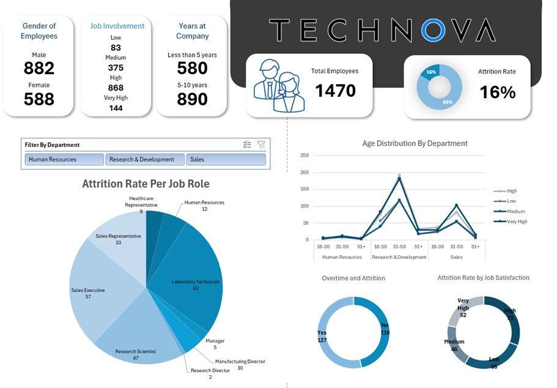

 

The third phase switched to delivering advice based off of my findings. My approach to this phase was a presentation style info deck that the client could access without needing a presentation. This would save time for both my team and the client, and make actioning my advice easier. 

This phase also included researching the sector that the client is in, as well as the general state of business within the UK. I used AI to sort through my research and conclude the most relevant results for this project.

The info deck consisted of my findings and why these were relevant, as well as my conclusions and the 4 key areas I felt the client needed to work on. These included early tenure, mid/long term employees, performance grading, and frequency of training. 

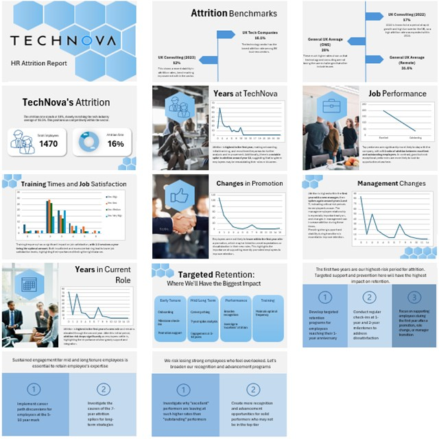

## Outcomes

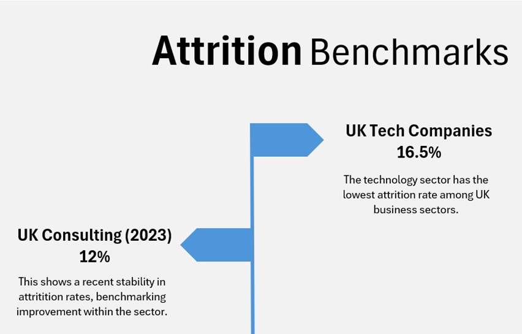
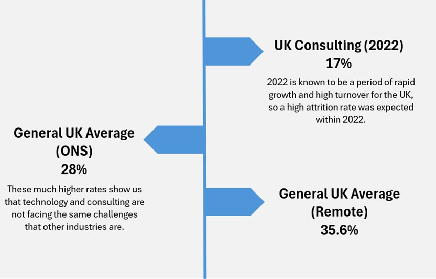
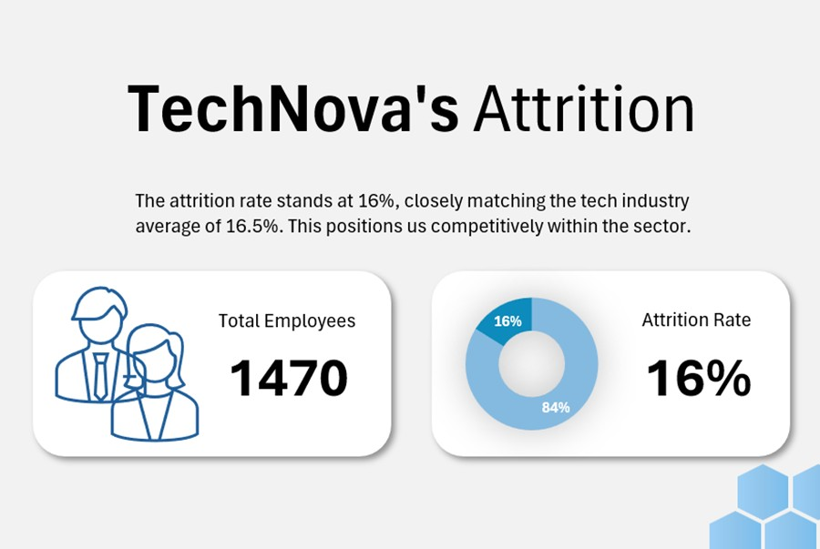
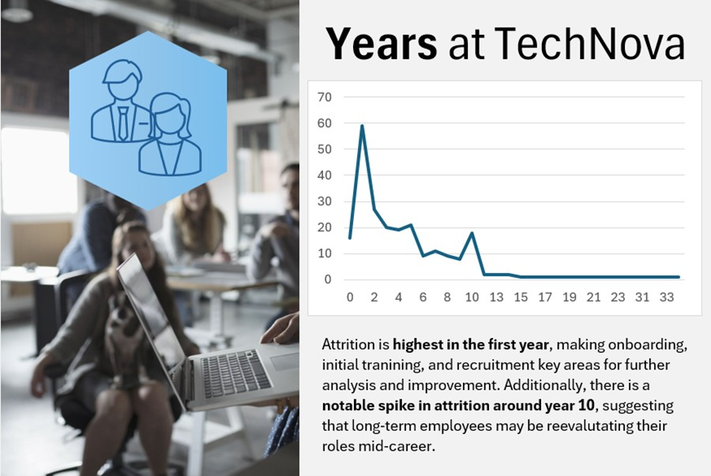

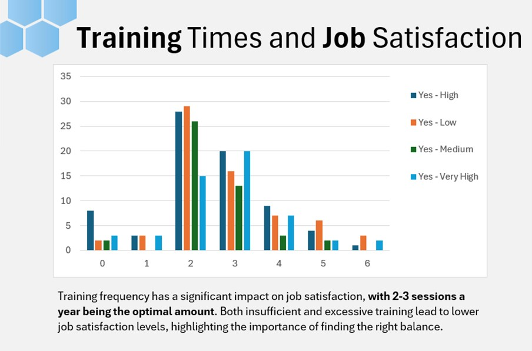
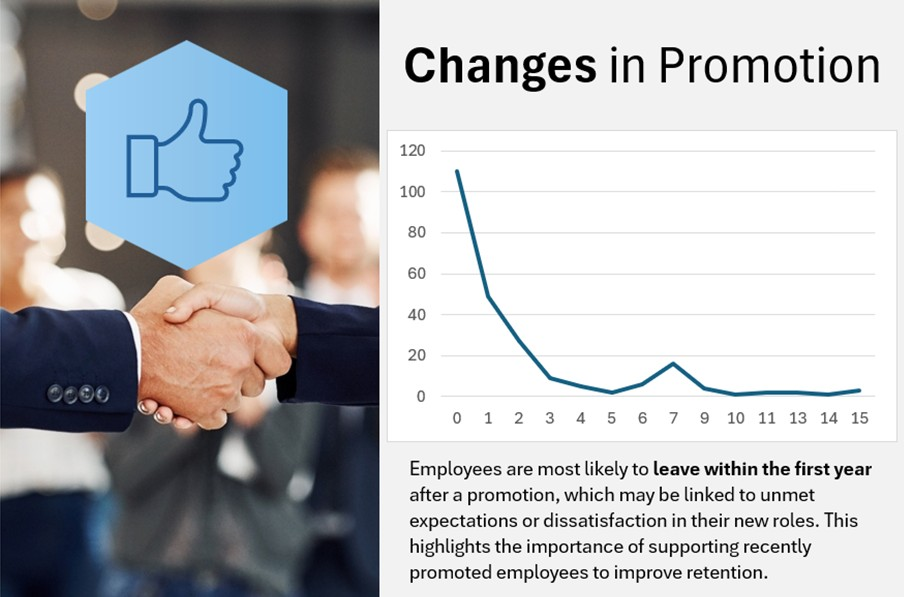
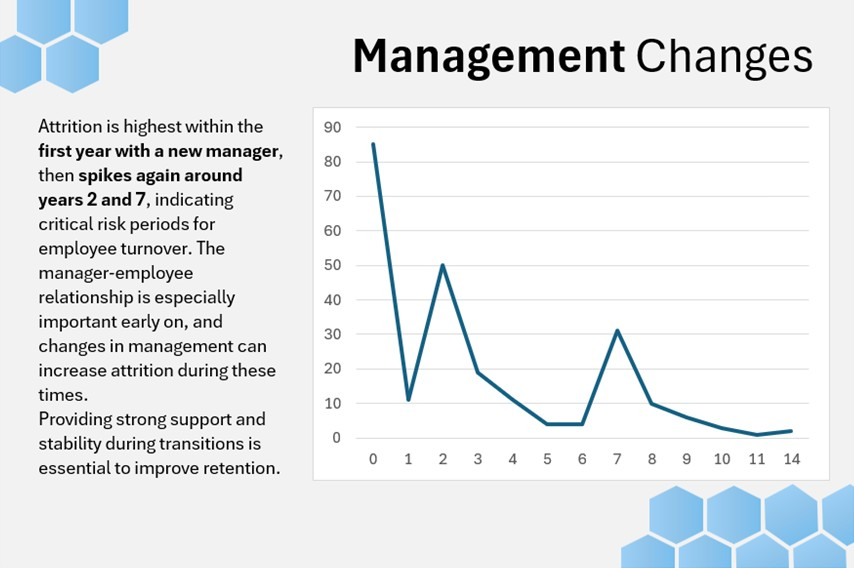
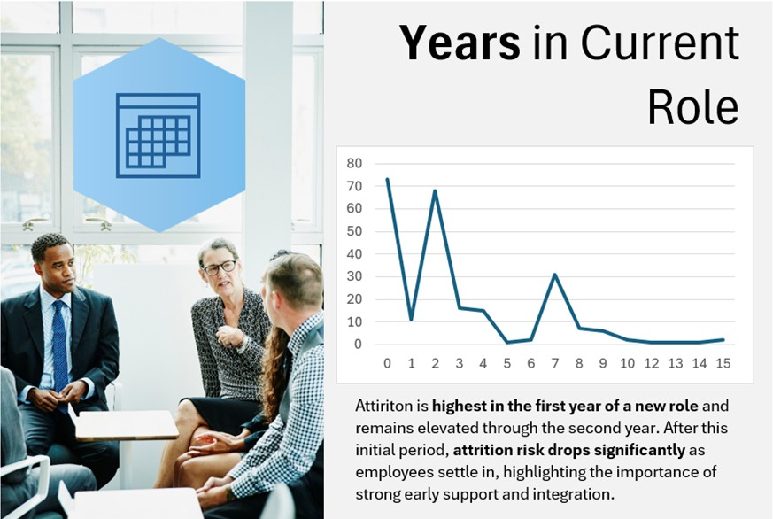
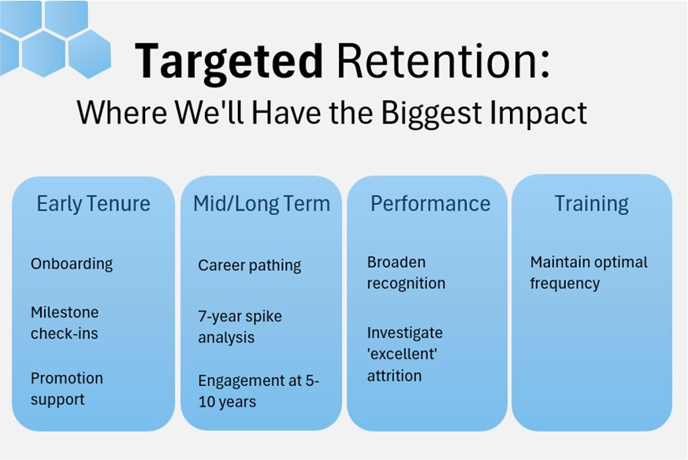
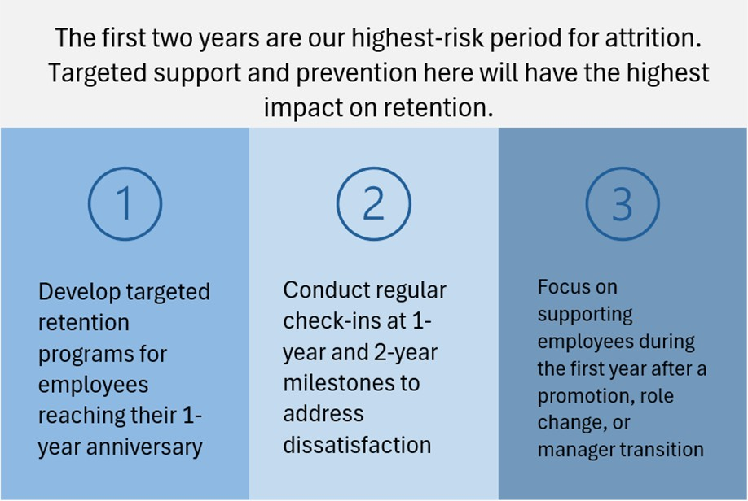
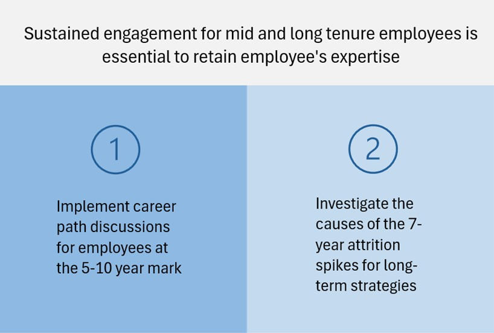
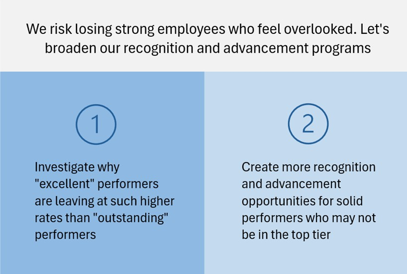